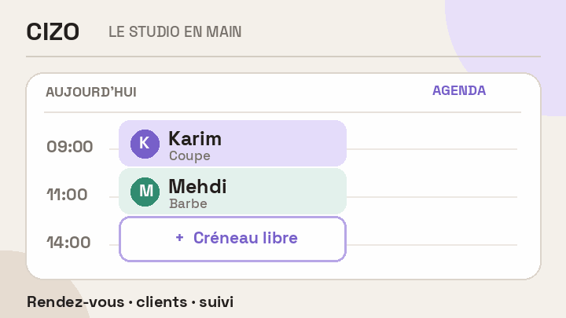

# Cizo

An operating desk for hair studios: appointments, client history and follow-ups in one place.

**[Explore the live product →](https://cizo.app/)**

The illustration shows the flow from an open slot to a confirmed booking. [See a capture of the actual interface](assets/workflow.gif): VIP filtering, a client's visit history and the team agenda in sample-data mode. Built with React Native. The application source remains private while the product is developed.
